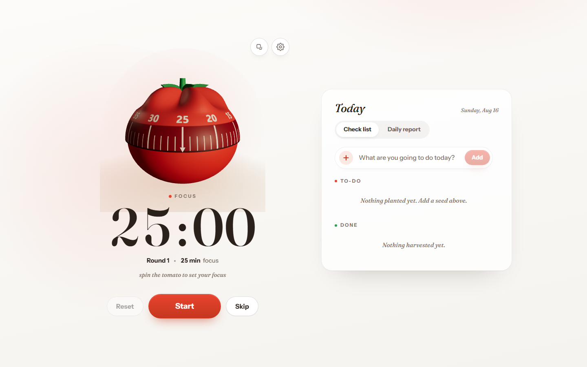
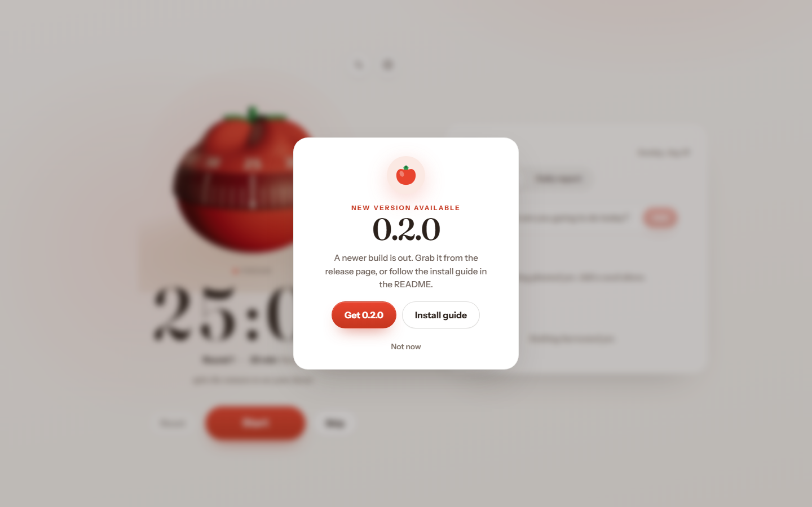

  

# Aka Nasu · トマトの時計

Aka Nasu (赤茄子) is a pomodoro focus timer for the desktop. Aka nasu is the Japanese word for red eggplant, another name for a tomato, and the tagline トマトの時計 translates to "the tomato clock."

The whole app is built around one tomato. You spin it to set your focus time, then a big serif timer counts down while you work through your list for the day.

  
  
  
  

## Screenshots

## Download

Grab the latest build for your platform from the [releases page](https://github.com/d3uceY/aka-nasu/releases). Every link below always points at the newest release, and each release ships a `SHA256SUMS.txt` so you can verify your download.

| Platform | File | Note |
| --- | --- | --- |
| Windows (installer) | [`aka-nasu-windows-amd64-installer.exe`](https://github.com/d3uceY/aka-nasu/releases/latest/download/aka-nasu-windows-amd64-installer.exe) | ⚠️ SmartScreen will warn — see first-run note below |
| Windows (portable) | [`aka-nasu-windows-amd64.exe`](https://github.com/d3uceY/aka-nasu/releases/latest/download/aka-nasu-windows-amd64.exe) | No install needed, just run it |
| macOS (Apple Silicon) | [`aka-nasu-macos-arm64.dmg`](https://github.com/d3uceY/aka-nasu/releases/latest/download/aka-nasu-macos-arm64.dmg) | ⚠️ Gatekeeper will warn — see first-run note below |
| macOS (Intel) | [`aka-nasu-macos-amd64.dmg`](https://github.com/d3uceY/aka-nasu/releases/latest/download/aka-nasu-macos-amd64.dmg) | ⚠️ Gatekeeper will warn — see first-run note below |
| Linux (x86-64) | [`aka-nasu-linux-amd64`](https://github.com/d3uceY/aka-nasu/releases/latest/download/aka-nasu-linux-amd64) | `chmod +x` then run |
| Linux (.deb) | [`aka-nasu-linux-amd64.deb`](https://github.com/d3uceY/aka-nasu/releases/latest/download/aka-nasu-linux-amd64.deb) | For Debian / Ubuntu |

1. Pick the file for your OS from the table above.
2. Run the installer, then open Aka Nasu.

### First run

aka-nasu is unsigned, so your OS may warn you the first time — it's safe and open source.

- **Windows:** SmartScreen → **More info** → **Run anyway** (or right-click the file → Properties → **Unblock**).
- **macOS:** Right-click the `.dmg` → **Open** → **Open** again (or System Settings → Privacy & Security → **Open Anyway**).
- **Linux:** `chmod +x aka-nasu-linux-amd64 && ./aka-nasu-linux-amd64`.

## Why I built this

I made this app for my raging ADHD, tbh. I know the classic 25 minutes on, 5 minutes off thing is a thing, but it does the opposite for me. Twenty-five minutes of focus and then a break just breaks me out of it, and every time I get back to work I've lost the flow state and have to climb back up from zero. The "productivity hack" was really just a machine for stopping me mid-thought and making me restart.

So i run this at 50 minutes on, 10 minutes off, with a longer break after four. Long enough to actually get deep into something, and a break long enough to stand up, stare at the wall (i honestly do not do this lmao)

Spin the tomato, set your own times. It's your clock, not mine.

## Development

You need Go, Node, and the Wails v3 CLI (`wails3`).

| Command | What it does |
| --- | --- |
| `task dev` | Dev mode with hot reload |
| `task build` | Production build |
| `task run` | Run the built app |
| `npm --prefix frontend run lint` | Lint the frontend with oxlint |